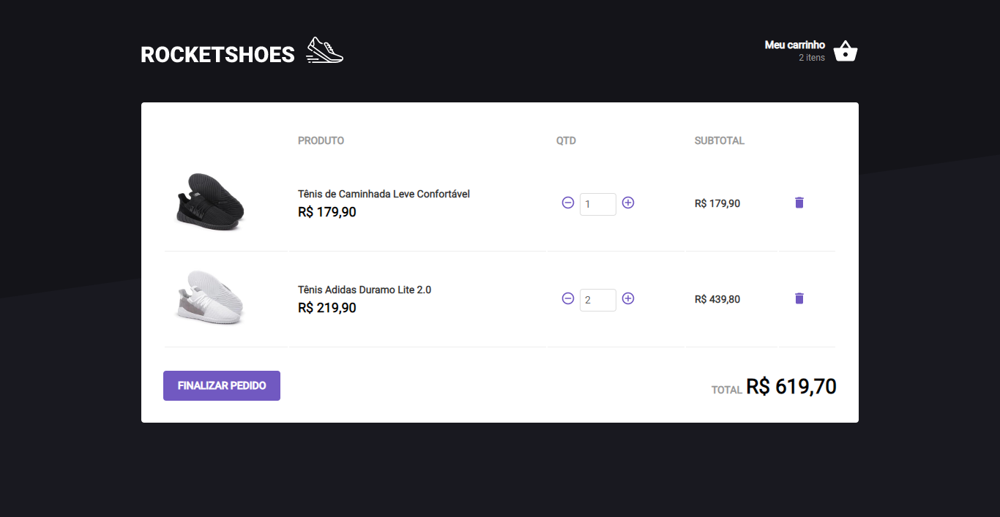

# Rocketseat Bootcamp - Rocketshoes ReactJS

Redux, Redux-Saga and React Hooks

## Steps to Setup

1. Install dependencies

```bash
> yarn
```

2. Run api

```bash
> json-server server.json -p 3333
```

3. Run app

```bash
> yarn start
```

Open <http://localhost:3000> to view it in the browser.



